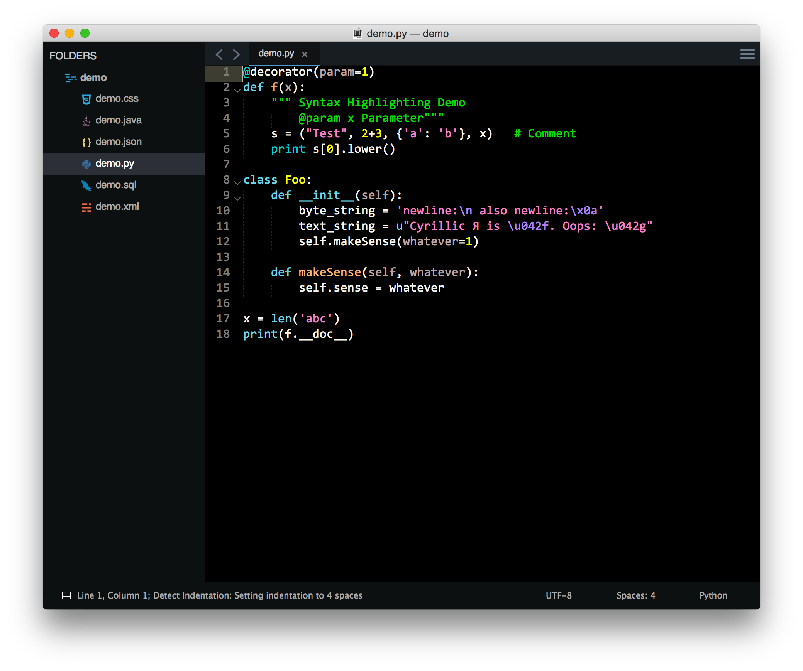
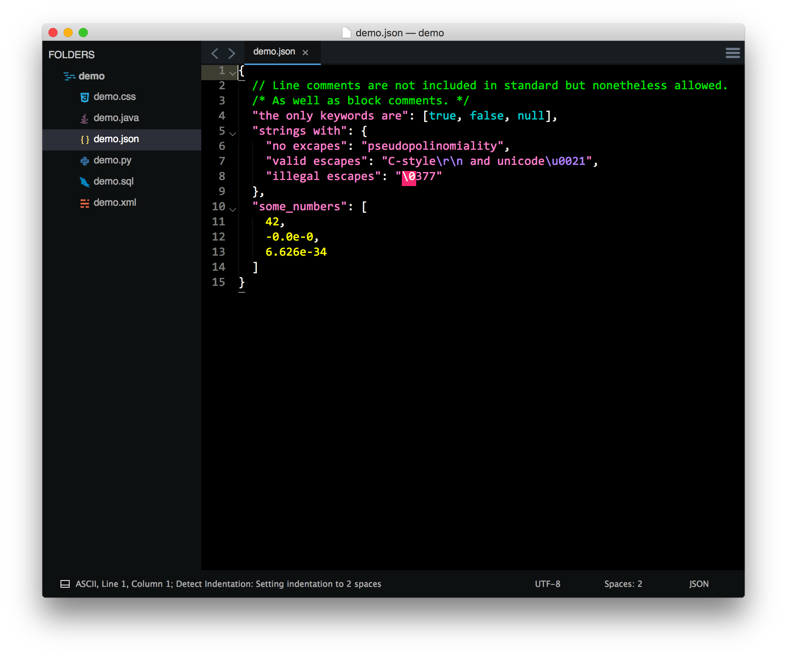
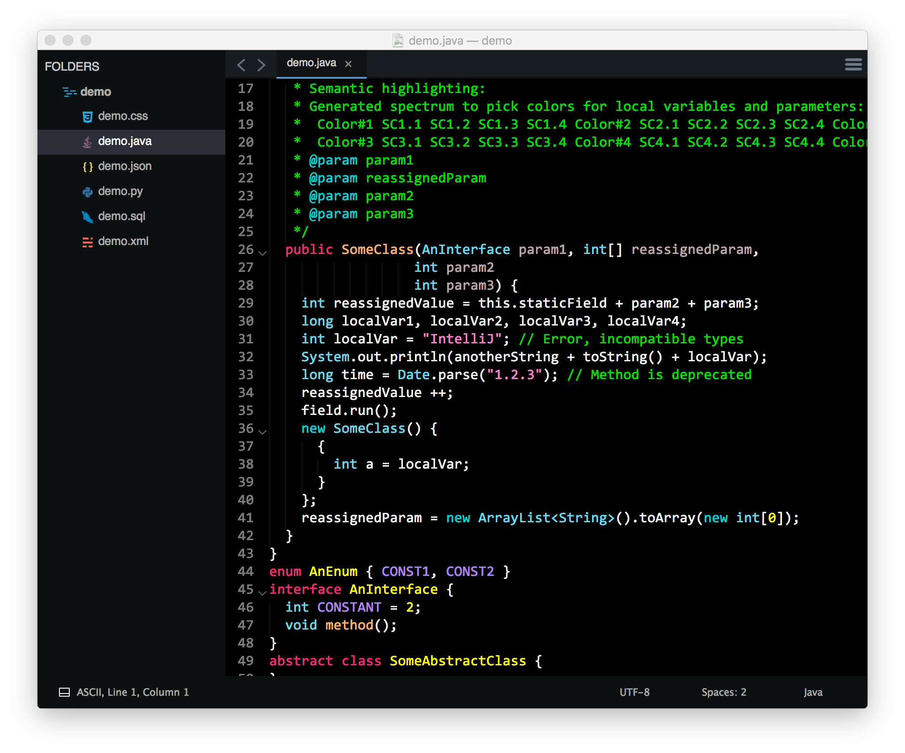
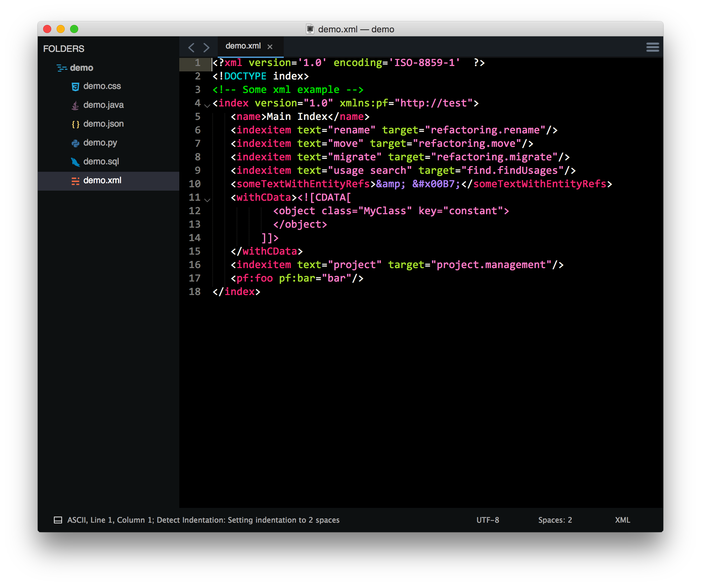
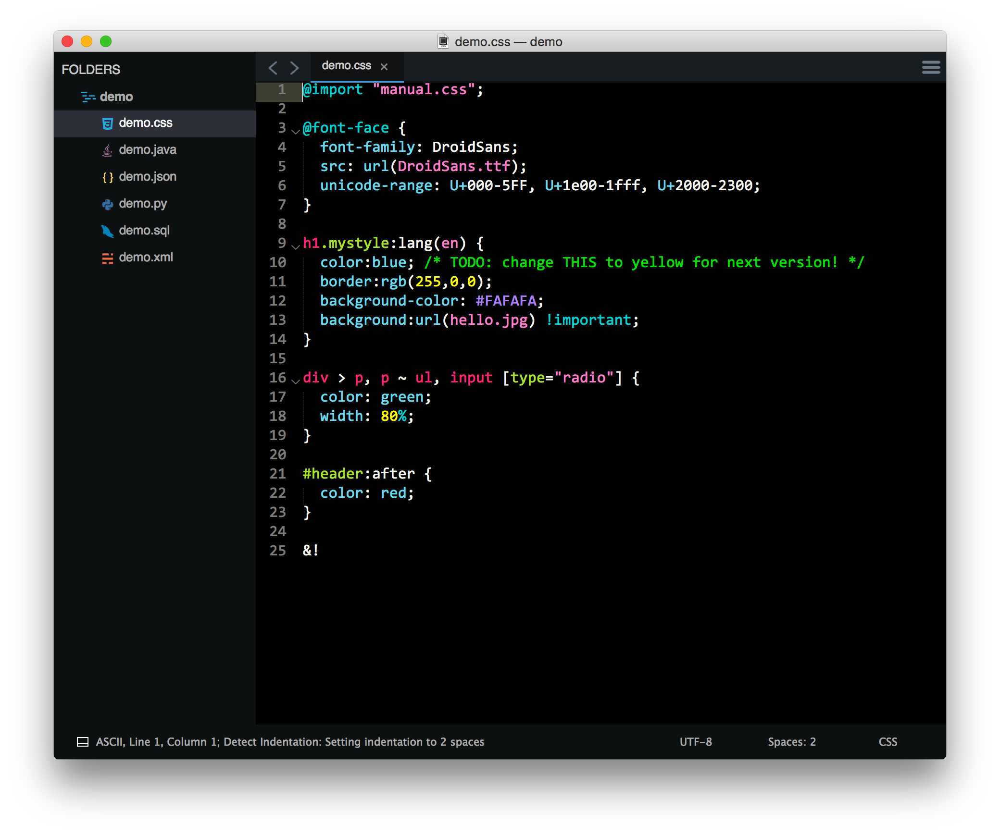
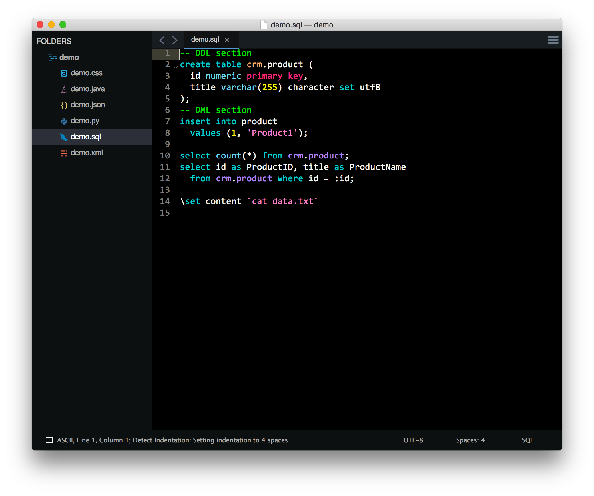

# Hytrast: A High-contrast Color Scheme for Sublime Text 3

## Features

* High contrast
* Completely black background
* Colorful and easy-to-read texts
* Multiple language support

## Install

1. Download <a href="https://raw.githubusercontent.com/nathanielove/hytrast/master/hytrast.tmTheme" download>`hytrast.tmTheme`</a>
1. Go to Sublime Text 3 --> Browse Packages
1. Create a folder named `hytrast` in the sublime packages directory, and move the `hytrast.tmTheme` into it.
1. Select "hytrast" in Preferences --> Color Scheme 

## Demo

### Python

### JSON

### Java

### XML

### CSS

### SQL

